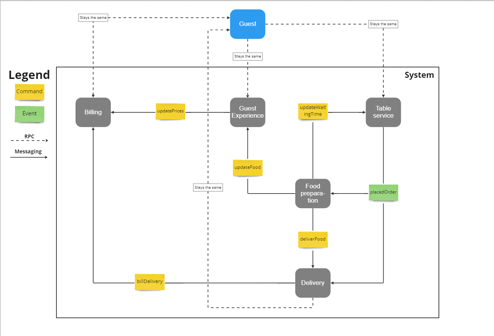

# Activity Log

## Team

- Markus Fichtner
- Hannes Eckelt
- Tabea Schaeffer
- Johannes Munker
- Carolin Doht

## Actors

- Food Preparation (Markus)
- Billing (Johannes)
- Delivery (Hannes)
- Table Service (Carolin)
- Guest Experience (Tabea)

## Part 1: Building the system in a naive way

### Timetable

| Date       | Activity Log                     |
|------------|----------------------------------|
| 2022-10-08 | Group creation, Define contracts |
| 2022-10-11 | Defined openAPI specification    |
| 2022-10-18 | Project planning meeting         |
| 2022-10-30 | Merge meeting                    |
| 2022-11-05 | Final testing                    |

### Log

- Create Repository
- Assign actors
- Define contracts
- Defined openAPI specification
- Create APIs
- Implemented business logic
- merge all services into master
- get docker running with all services
- test communications between services
- fix existing bugs and merge
- final testing

### Food preparation

###### Approach

1. Defined endpoints for requesting the food information and ordering a new meal
2. Used the node.js TypeScript template as a Base and added 2 new classes: Food Preparation and Cook
3. Implemented all endpoints in index.ts
4. Implemented required functionality behind Food Preparation and Cook classes
5. Refactoring to Utils and types
6. Tested both endpoints using Postman

###### Problems

- Difficulty testing fetch functionality without running services

### Billing

###### Approach

1. The first thing was the definition of the item registry endpoint
2. Then I added the billing service from the node-ts template
3. After that I added a general code structure
    - For that I added a BillingService class and defined methods without implementing them
    - Also, I added all necessary endpoints without implementation
    - The last thing I added were types for TypeScript, the contract definition as base
4. The BillingService class was the first thing I implemented
    - I implemented all defined methods and added mock data for the menu
5. Then I implemented all endpoints and added responses for each possible case
    - After that I tested the code with requests from a Postman Runner
6. I changed the delivery endpoint to be more consistent
    - For that I changed my code accordingly and communicated with Hannes to adjust his implementation as well
7. After we tested, I noticed that my service has a problem with multiple orders and fixed that as next step
    - For that I had to change the model and rewrite a lot of code
8. As last step I refactored my code to make it more readable

###### Problems

My service had a problem with multiple orders, as I mentioned above. I noticed in an earlier implementation that I never return a 202 status code for an updated bill, which is
defined in the openAPI definition. The requirements for updating a bill were not clear for me in the beginning, until we tested. This resulted in a lot of code rewriting, model
adjustments and refactoring.

### Delivery

###### Approach

1. Create Open Api document for Delivery
2. First documentation of "orderInformation" and "preparedNotification" endpoint
3. Create a Delivery Service in the project
4. Implementation of endpoints
5. Implementation of data processing for received order information and prepared notification
6. Exchange with Billing (Johannes) about post request to endpoint
    - Add parameter to requests
7. First merging of all Services
    - included testing session where minor bugs in Delivery were fixed
8. Refactoring of code after merge tests
9. Final merge for first Assignment

###### Problems

- Changes in endpoint leaded to minor refactoring
- There were a couple of challenges after all Services were merged

### Table Service

###### Approach

1. I didn't need to create any endpoints in the API
2. I added the table service from the node-ts template
3. I implemented the class order with all defined methods
4. I implemented the defined endpoints
5. I refactored my code

### Guest Experience

###### Approach

1. Defined endpoint for Prices in the OpenAPI Specification for Billing
2. Implemented menu and prices endpoints in index.ts
3. Implementation in menu.ts for receiving the menu Items from FoodPreparation
5. Implementation for required functionality behind GuestExperience
6. Refactoring of the code
7. Final merge

###### Problem

- Testing the fetch without running services

### General Problems

- testing fetch without docker running
- http protocol was missing in the docker-compose file

---

## Part II: Introduction of failure modes

### Timetable

| Date       | Activity Log                            |
|------------|-----------------------------------------|
| 2022-11-21 | Testing fallacies + error documentation |
| 2022-11-26 | Merge + Testing Meeting                 |
| 2022-11-29 | Log optimization                        |

### Log

- Individual implementation of fallacies per service
- Merge of all fallacies into Master
- Chaos testing
- Write error documentation (refer to our [error log](errorDocumentation.md))
- Individual fixing the errors with Design Patterns
- Merge Patterns
- Testing the system
- Fixing Bugs
- Final Merge and testing

### Food preparation

###### Approach

1. Implemented a fallacy to return a 505 status code with a predefined probability
2. After testing all the occurring errors I started implementing the receiving part of the Idempotency pattern.

- updated OpenApi Spec to include a request_id
- store request_ids and implement check for duplicates

3. Merge fallacy handling into master
4. Testing the system
5. implementing Bugfixes for the general system

### Billing

###### Approach

1. Implemented a fallacy to return a 500 status code for some item deliveries
    - For that I generate a random number and check if it's under or equal to the error threshold (in our case 0.1)
    - If so, I set the status code to 500 a return an according message
2. After we merged all our fallacies together, I created a new branch and started with the handling of the occurring errors
3. I started with a duplication check for delivered items registration
    - Delivery sends an idempotency key, which I'm retrieving and adding to an array
    - For new item registrations, I'm now checking if the ID already exists in the array
    - If so I won't process the registration and return a 400 error
4. Next I added the handling for the main fallacy for my system, which is the menu not/ slowly getting sent
    - For that I firstly added a timeout of 5 seconds to the request, so that it doesn't wait the whole time
    - Next, I extended my catch block to handle errors properly, which gets run, if the fetch times out
    - In the handling function, I have two blocks
    - One is a normal retry with a delay, which uses a fibonacci number depending on a retry counter
    - The retry counter is 5 and gets reduced by 1 on every try
    - The second one is a circuit breaker, that runs, if the retry counter is 0
    - The breaker just waits a bit longer (1 minute), then retries and sets the retryCounter to 5 again
    - The whole thing is recursive and repeats itself until the menu could be retrieved
5. For better debugging I also added more logs as next step
6. The last thing I added is a new error response of 404 to the customer, when he tries to get a bill before the service has the menu

###### Problems

The last thing I mentioned in the block above is an edge case, which in my opinion cannot be handled properly. If the menu cannot be retrieved from the manager and the customer
wants a bill, the system will return a 404 error saying the menu and therefore the prices are not available. On the customer side only the error „No open bills“ will be shown,
which does not quite meet the error message itself. I guess a solution would be an according message on customer side.

### Delivery

###### Approach

1. Implementation of response Delay to TableService
    - Timeout of 60s is set for a chance of 10% after
2. Identification of fallacies that affect DeliveryService -identify 500 response of Billing as major issue
3. Creating Concept based on patterns to handle fallacies
    - Retry: Retrying of messages after receiving 500 response
    - Idempotency Key: Using a key when resending to avoid duplicated messages
4. Implementation of Concepts
    - Retry: Defining a Loop which resends Message until positive response is received. Delay for resending is based on Fibonacci sequence.
    - Idempotency Key: Adding deliveryNumber to message Header so Billing can identify duplicate messages
5. Unit testing of DeliveryService
6. Merge all Services together
7. Testing whole System after merging
    - Fixing of multiple bugs in DeliveryService
8. Refactoring DeliveryService
9. Final merge and testing

###### Problems

- For our surprise the implementation for the delayed TableService response also affected the DeliveryService. When the service was blocked send meals from Food preparation were not
  matched in my DeliveryService. They were never send to the customer. This was fixed, by also blocking the messages coming from food preparation(When managers are smoking they
  will also not directly take the meals coming from the kitchen.)

- Issue with the data storage in the DeliveryService occurred. Because of the timeouts, the implementation to find orders within an Array was not working Properly(indices were
  switched due to new incoming meals). This was fixed, by putting the item search out of the blocked service part

### Table Service

###### Approach

1. Implemented a fallacy which duplicates the orders sent to food preparation
    - I generated a random number and checked if it's under or equal to the error threshold (in my case 0.1)
    - If so, I set a counter to 2. I then created a while loop in which the order is sent. If the counter is 2 then the while loop is run through twice and the order is therefore
      duplicated
2. After merging all fallacies I started handling the created fallacies
3. In order for the food preparation to determine which orders were duplicated I implemented an id to send with the meals to food preparation. The id is incremented for each meal
   per order. If the above-mentioned counter is set to 2 the id is reset to the value of itself before the order was sent. With duplication: the order is sent again with the
   identical id values
4. When only drinks are ordered the method of sending the food to food preparation is run though. As a result the id of the order was counted upwards even though no food had been
   ordered. I therefore added a condition to check if the food order is empty. If so I return 0 to break out of the method, so it is not fully run though
5. To better understand what is happening I added logs

### Guest Experience

###### Approach

1. Implemented a fallacy which delays in 10% of the time the requests from Billing to GuestExperience for 60 seconds
2. After merging all fallacies in the Master, I analyzed which failures need to be fixed within GuestExperience
    - The cook is sometimes to busy to send the MenuItems
3. Implementation of Design Patterns
    - Retry: when GuestExperience does not get the MenuItems it should try it again in a certain time (every retry it should be a bit longer)
    - Cache: if GuestExperience has all ready retried it for a certain amount, it should use the cache (which was saved earlier) when the is no cache it should retry again
4. Testing of Patterns
5. Merge all Services together
6. Fixing the new problems that occurred after the merge
7. Final merge and testing

###### Problems

- When merging the added patterns, the GuestId (which is created by GuestExperience) had stopped working properly --> solution: separation of create menu from get prices

### General Problems
Unexpected errors occurred, that were not directly linked to a certain error we implemented. For example were causing two fallacies together a new error. Debugging was very hard in some cases because of that.

---

## Part III: Decoupling via Messages

### Timetable

| Date       | Activity Log                            |
|------------|-----------------------------------------|
| 2023-01-06 | including RabbitMQ |
| 2023-01-07 | Defining contracts |
| 2023-01-08 | Implementation of contracs              |
| 2023-01-09 | Created a diagram for the messaging topology             |
| 2023-01-11 | Merge + Testing Meeting                 |
| 2023-01-12 | Testing Meeting                         |

### Log

- Including RabbitMQ
- Defining contracts
- Created a diagram for the messaging topology
    - 
- Implementation of contracts with asyncapi
- Merge
- Fixing Bugs
- Testing the system
- Fixing Bugs
- Final Merge and testing

### Food preparation

###### Approach
1. Created `RabbitMQ` singleton class for connection to RabbitMQ and sending and receiving messages
2. removed Http Endpoints 
3. implemented eventListener for `placedOrder` Event 
 - old logic is used to handle Order logic 
 - instead of one food item per request the Event contains the entire order
4. To return the waitingTime to TableService the `updateWaitingTime` command is sent
5. `updateFood` Command is sent at the innitalization of the service
6. once a orderItem is prepared `deliverFood` command is sent to Delivery
7. Merge
8. Fixing Bugs
9. Testing

###### Problems
1. Removed BUSY COOK fallacy because request was removed for command

### Billing

###### Approach
1. Created a `RabbitMQ` class for communication
2. Use and initialize `RabbitMQ` class in `BillingService` class
3. Changed `getMenu` function to `subscribeToMenu` function, which listens to "updatePrices" commands from GuestExperience
4. Added the function `subscribeToDeliveries`, which listens to new delivery commands ("billDelivery") from Delivery
5. Added `subscribeToMenu` and `subscribeToDeliveries` to constructor to start listening to commands
6. Added Type Guards to check 
 the received data meets the expected type
7. Removed unnecessary code like the "registerDelivery" endpoint, some error handling and the fallacy, which blocks deliveries since it doesn't make sense anymore
8. Merging
9. Small adjustments and fixes after merging
10. Testing

###### Problems
-
* Changes in data structure, like "deliveryId" were not communicated directly -> it was in the header previously and was moved to the response body -> the code had to be adjusted twice
* getting the system running again was a little bit hard since fixes had to be done step by step

### Delivery

###### Approach
1. After agreeing on contracts making own concept for implementation
2. Implementing connection to `RabbitMQ`
3. Creating subscription to event `placedOrder` of `Table service`
4. Creating subscription to command `deliverFood` of `Food preparation`
5. Refactoring RPC redundant code
6. Defining command `billDelivery` to `Billing`
7. Merge code and do testing
8. Alling message properties
9. Merge again
10. Final testing

###### Problems
-Inconsistency in connection properties leaded to connection issues
-Understanding differnence between `Exchange` and `Queue`
-Implementing existing business logic with new way of communication

### Table Service

###### Approach
1. Contract definition: I send an event to `Food Preperation` and `Delivery`
2. 

### Guest Experience

###### Approach
1. Defining contracts between: `Billing` and `Food Preperation`, both are `Commands`
2. get connection to RabbitMQ
3. creating Channel to listen to command from `Food Preperation` to get the food which creats then the menu 
4. implemntation of sending the prices to `Billing` via `Command`
5. removed Http Endpoints
6. Merge all Services together
7. Fixing the new problems that occurred after the merge
8. Final merge and testing

###### Problems
- Messages could only be tested after the merge with all services

### General Problems
- Keeping all queue Names and options consistent

---