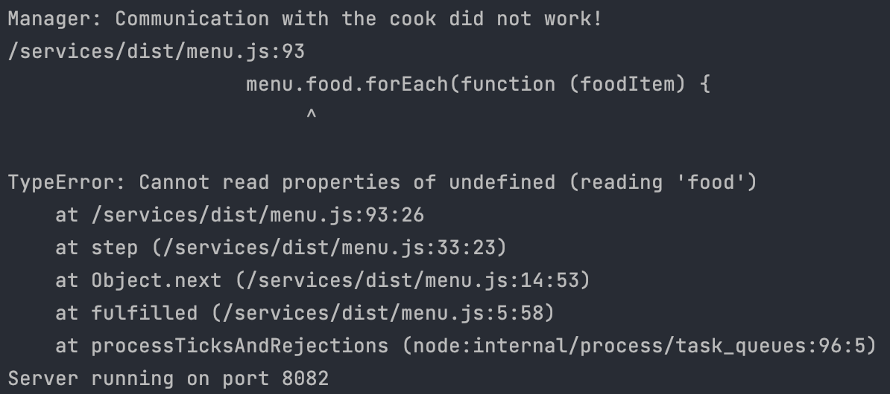
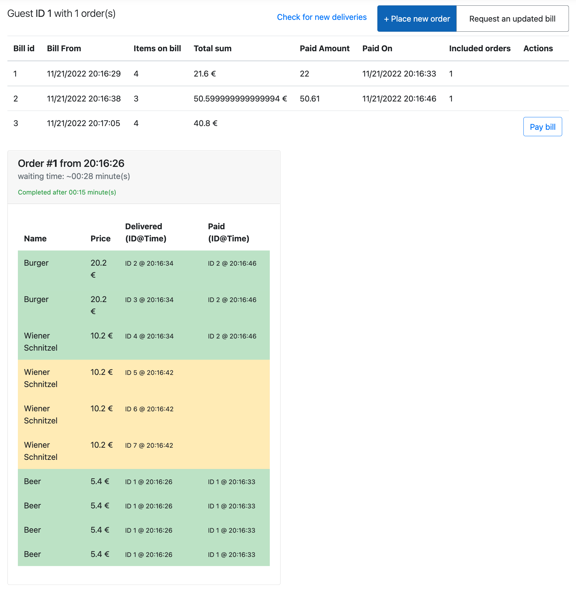
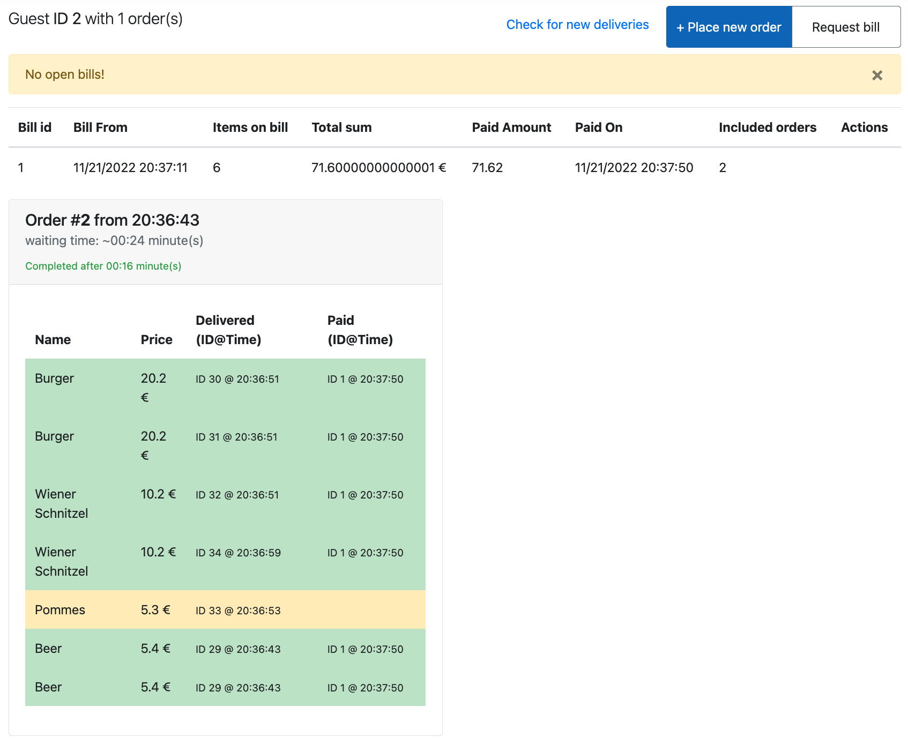
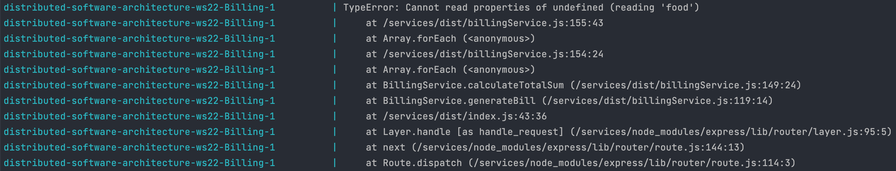

# Error Documentation

---

## 1. No Nutritional Information

This error can be traced back to the „Busy Cook“. The cook has no time and doesn't give the nutritional information to the Manager, which leads to missing information.

### Error Screenshots

### System Behaviour

- This error can occur, if a new guest is created, because the menu is fetched for each user on create
- If this happens for the first guest, the whole GuestExperience crashes
- If it happens with a guest later, the Customer crashes and GuestExperience only logs the error

## 2. Order Duplication

This error can be traced back to the „Forgettable Waiter“. Sometimes an order gets sent twice to the cook, which leads to more items in the system than there should be.

### Error Screenshots

### System Behaviour

- differences in the amount of items ordered and the amount of items in the system
- this leads to a bill with a wrong total sum, because more items than the user ordered are in the system
- in the screenshot above is the total sum of the last bill 40.8€ but all unpaid items together equal only 30.6€

## 3. Missing Items in the billing system

This error can be traced back to the „Occupied Cashier“. From time to time he is to busy writing bills and can't register delivered items. This leads to missing items for customer bills.

### Error Screenshots

### System Behaviour

- Billing sometimes doesn't accept items from delivery, to mark them as delivered
- the customer receives the items but they are not registered
- therefore, the item will never be billed because it's not in the system anymore
- the screenshot above shows on unpaid item (Pommes) but if a bill is requested, Billing says there are no billable items

## 4. No Menu Prices

This error can be traced back to the „Overworked Manager“. She is sometimes too slow sending back the menu to billing, which causes him to not be able to create bills due to missing price information.

### Error Screenshots

### System Behaviour

- Guest Experience sends the prices for items to slow to Billing
- since he doesn't re-fetch those, the prices are missing in his system, so he can't write bills
- because this is not handled in code, the Billing service crashes

---
